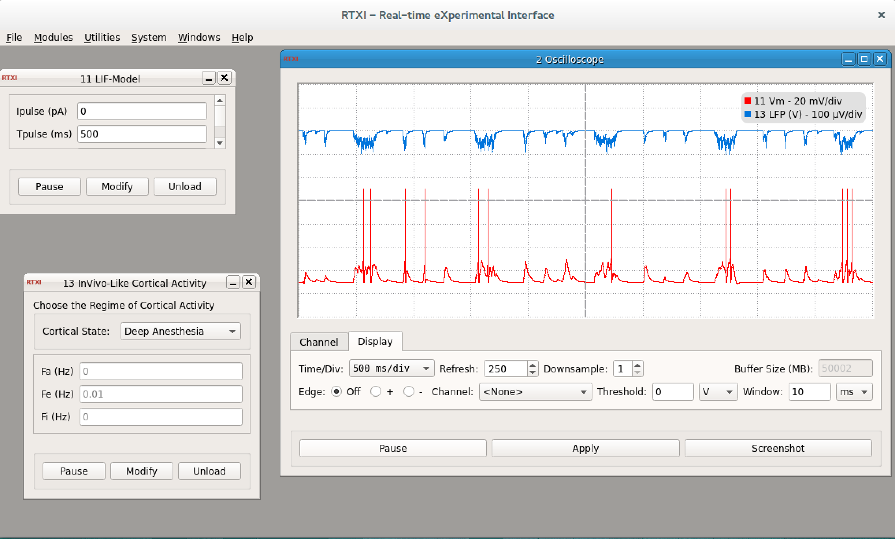
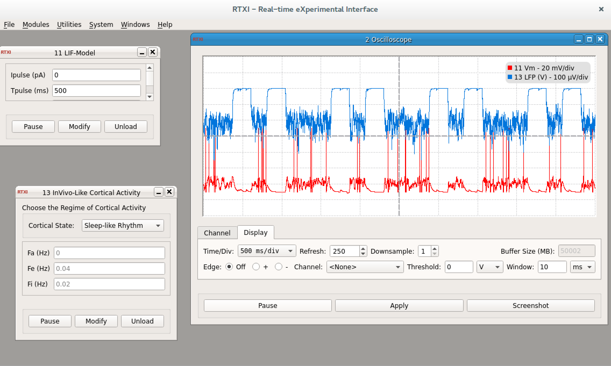
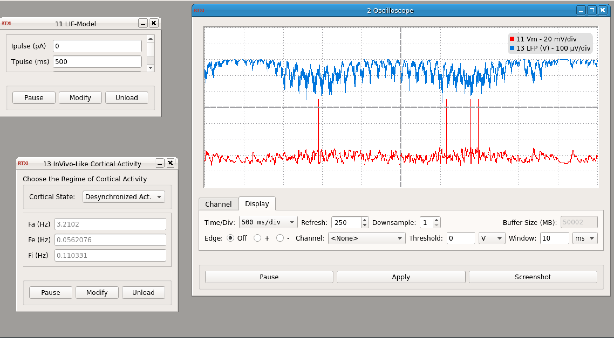

### Emulating spontaneous cortical activity seen in-vivo through 

**Requirements:** None  
**Limitations:** None  

<!--start-->

This module aims at reproducing the synaptic bombardment targetting a single cell in cortical networks. The currents are based on Poisson point processes convoluted with exponential waveforms. For the rationale of such models and similar dynamic-clamp implementation (for in-vitro experiments), see e.g. the (non-exhaustive) following publications :

#### N.B. This classification has not been peer-reviewed and does not
     constitute a "state-of-the-art" paradigm! The three proposed
     regimes are only a vague scheme of what can be observed in the
     "in vivo" cortex. The theoretical model underlying the ongoing
     dynamics has been derived through arbitrarily-taken network
     activity waveforms.

The config file producing the snapshot (i.e. combined with my LIF-model implementation) can be found on this 

<!--end-->

####Parameters

hidden in the code

Shift Cortical State through the GUI button !

